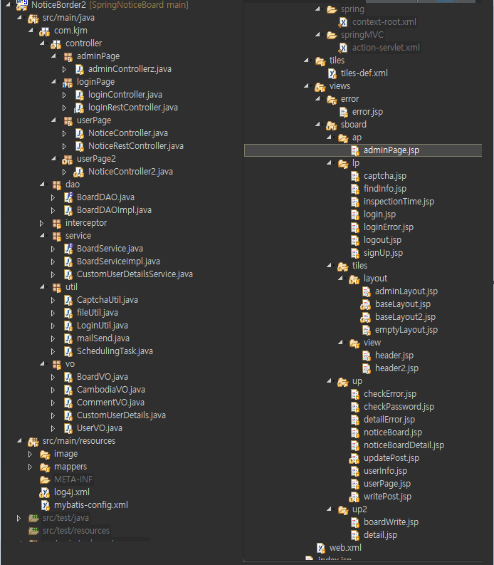

# NoticeBoard

## 제작 목적

- JavaScript, jQuery 등의 실력 향상
- Spring MVC 모델을 통한 웹 앱 구성에 대한 이해 및 적응
- 다양한 기능 추가를 통한 경험 상승

## DB

## app 구성도

## 개발 과정

### 학습 및 기본 CRUD 구성

- Web 개발을 위한 Spring MVC 모델의 게시판 app 구상
- 해당 app에 대한 개발계획서 작성
- app의 기본적인 구성 및 아키텍쳐 작성
- 기본 CRUD 기능 외 주입할 부가적인 기능 및 서비스에 대한 Table 구성
- 관계에 따른 테이블 정의서 작성
- 준비한 프로젝트 기초 설정과 세부 패키징 및 부가 기능에 따른 필요 jar 주입
- 페이지 스타일 구성
- 임시 생성한 게시글에 대한 조회 기능 및 페이징 기능 추가
- 부족한 JS 관련 능력 향상을 위한 front 에서의 logic 구현을 통한 처리
- RestAPI에 대한 학습 
- json 자료형에 대한 이해
- 일반 컨트롤러의 jsonview 기능에 대한 이해
- Ajax를 통한 동적인 페이지 표현에 대한 학습 및 해당 기능 적용
- Spring Framework를 보다 유연하게 사용하기 위해 해당 구조에 대한 재차 학습 실시
- 게시판 상세 기능 추가 및 로그인 기능 추가를 위한 준비
- 게시글 검색 기능 추가
- 게시글 상세화면 별도 구성 및 게시판 세부 기능 추가

### Spring Security 를 이용한 계정 사용 및 권한

- 로그인 기능을 위해 Spring Security에 대한 학습 실시
- Spring Security에 대한 이해 및 해당 기능 추가
- Security를 이용한 로그인 기능 추가(하단 로그인 화면 사진 첨부)
- 기존 게시글 관리 테이블과 사용자 테이블 연동 
- session에 대한 이해 및 session을 통한 사용자 권한 변경에 대한 학습
- session을 통해 사용자 권한 획득하여 해당 사용자의 게시글 관리 기능 추가
- 사용자 별 권한의 차이를 두어 관리자 계정을 통한 전체 페이지 관리 구상
- 관리자 페이지를 따로 생성하여 게시판의 전체적인 관리 능력 부여
- 권한에 따라 페이지에서 보여지는 화면의 차이를 둠
- 계정 정보 관리 페이지 및 개인 정보 수정 기능 추가
- ID 찾기, 비밀번호 찾기 기능 추가
- 메일 발신을 위한 SMTP에 대한 이해
- ID, 비밀번호 찾기를 위해 네이버 메일 기능 연동 및 메일 전송 기능 추가
- 게시글 별 댓글 기능 추가
- 게시글 작성을 위한 게시글 관련 테이블 생성 및 타 테이블과의 연동
- 게시글 별 댓글의 권한 별 CRUD 기능 탑재
- 댓글 등록자에 한한 삭제기능 추가
- 회원가입 시 단순 회원 가입 방지를 위한 검증 기능 필요 확인
- Open API 사용을 위한 사전 학습 실시
- 네이버 Open API 적용
- 네이버 Open API 중 이미지 캡차 기능을 통한 회원가입 절차 구상
- 스케줄러 적용
- Open API를 이용하며 비교하기 위한 Image가 제한이 없이 쌓임을 확인
- 서버의 Image 저장 폴더 비우는 util Class 추가
- 매 같은 시간에 반복적으로 해당 기능을 작동시키기 위해 스케줄러 기능에 대한 학습
- cron 표현식에 대한 이해 및 스케줄러 기능 적용을 통해 매일 12:00에 해당
- 폴더 청소 실시, 11:58~12:03 까지의 회원가입 제한 기능 적용

### 파일 관련 및 기타 기능 추가

- 게시글 파일 업로드, 다운로드 기능 추가
- 파일 관련 테이블 작성 및 타 테이블과의 연동 및 종속
- 서버의 원활한 파일 저장 및 관리를 위해 UUID를 통한 파일명 지정
- 게시글 별 파일에 대한 CRUD 기능 탑재
- 엑셀을 통해 DB 정보 입출력하는 기능 및 해당 파일 보호 압축 기능 추가
- 게시글 등록 및 댓글 등록 시 유저의 경험치 증가 기능 추가
- 경험치를 통해 유저의 권한 상승 기능 추가
- 고정된 헤더 사용을 위해 tiles 기능을 이용한 고정 Layout 기능 추가
