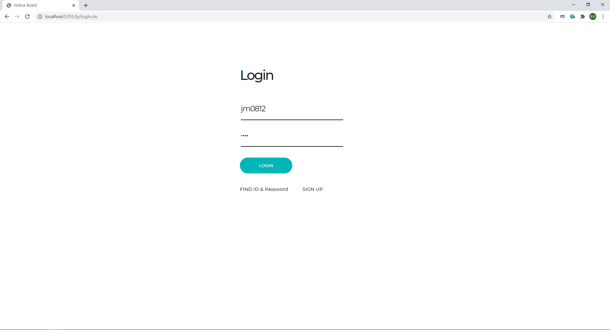
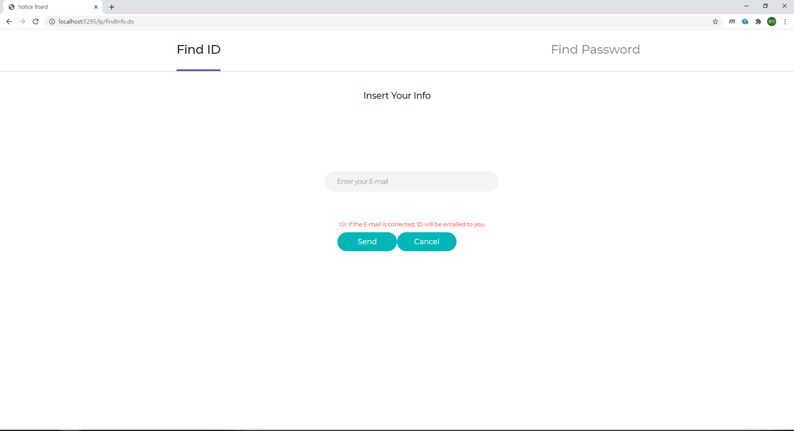
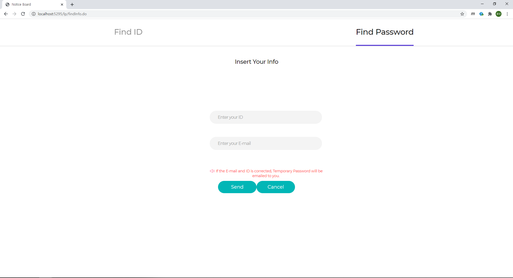
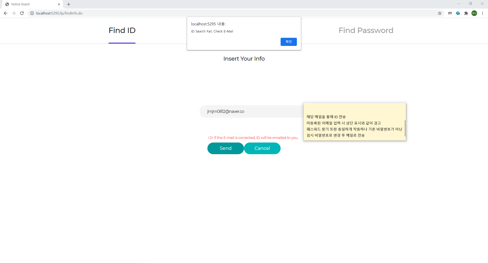
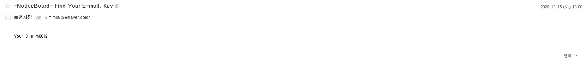
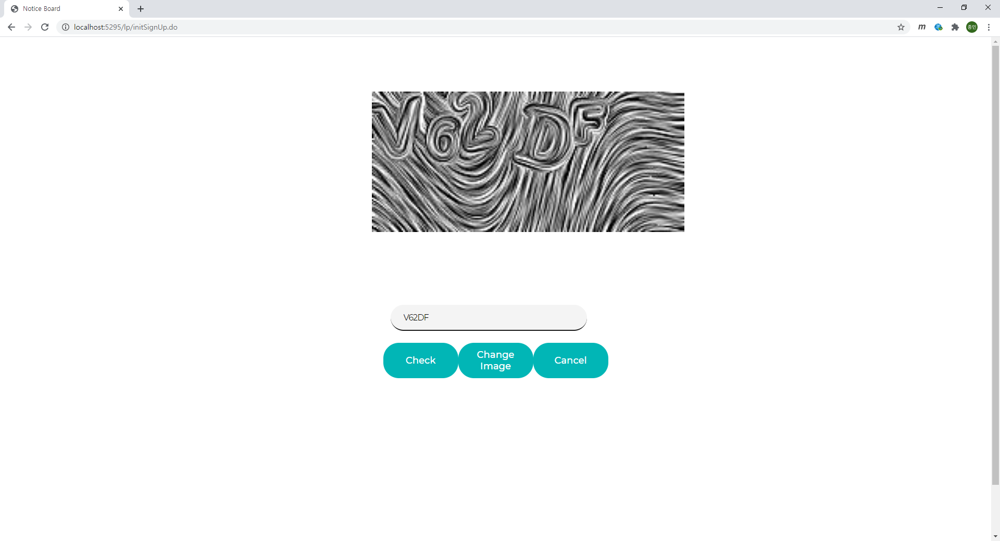
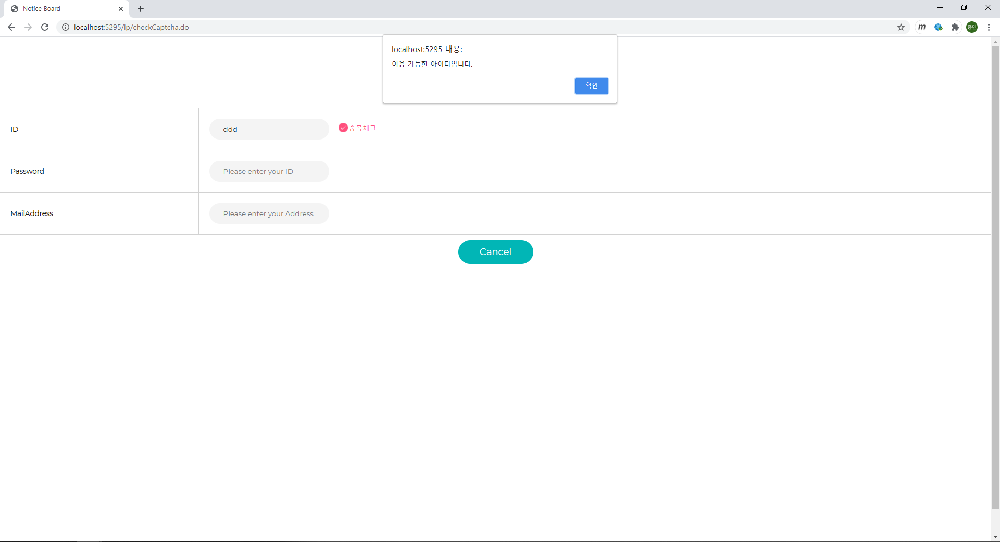
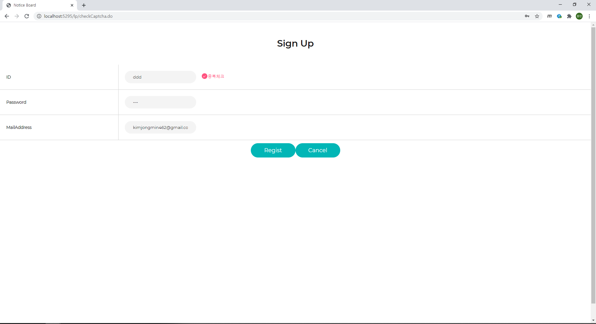

# SpringNoticeBoard

## 로그인 화면 - login.jsp

## ID, 비밀번호 찾기 화면 - findInfo

### Id를 찾는 경우 

### Password를 찾는 경우

### Id 찾기  진행

### Id 찾기 결과 화면

## 회원가입 화면

### 자동 가입 방지를 위한 네이버 Open API Captcha 사용 화면 - cpatcha.jsp

### 회원가입 화면 (중복검사 전) - signUp.jsp

### 중복검사 후

