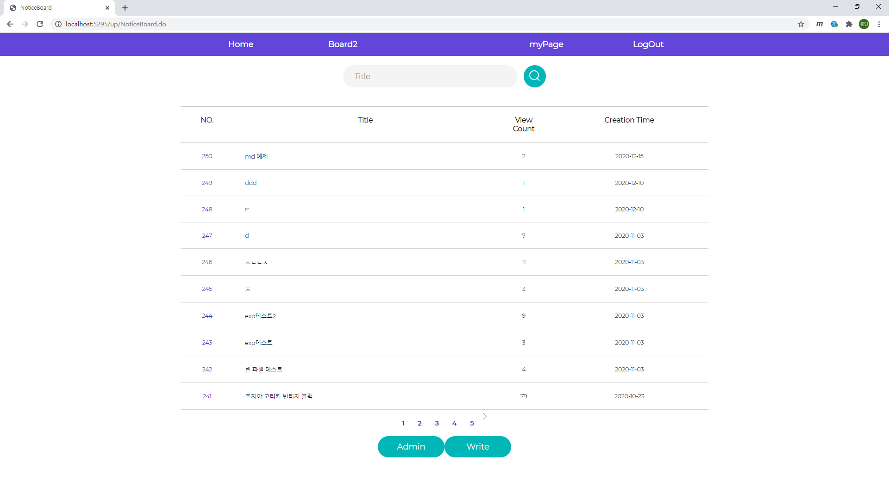
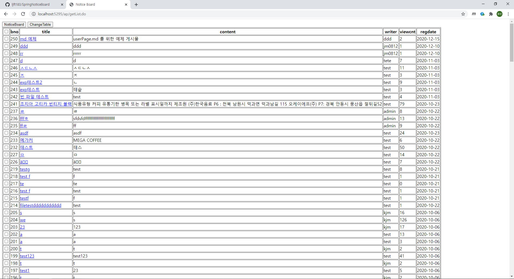
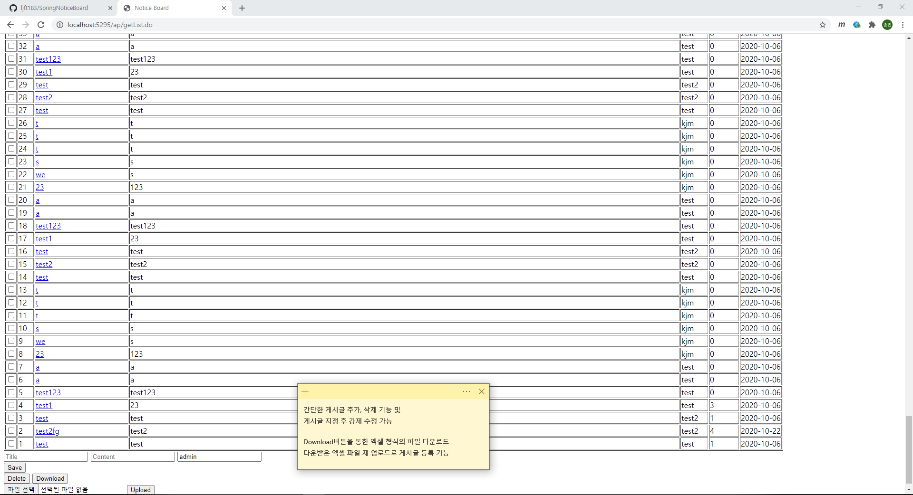
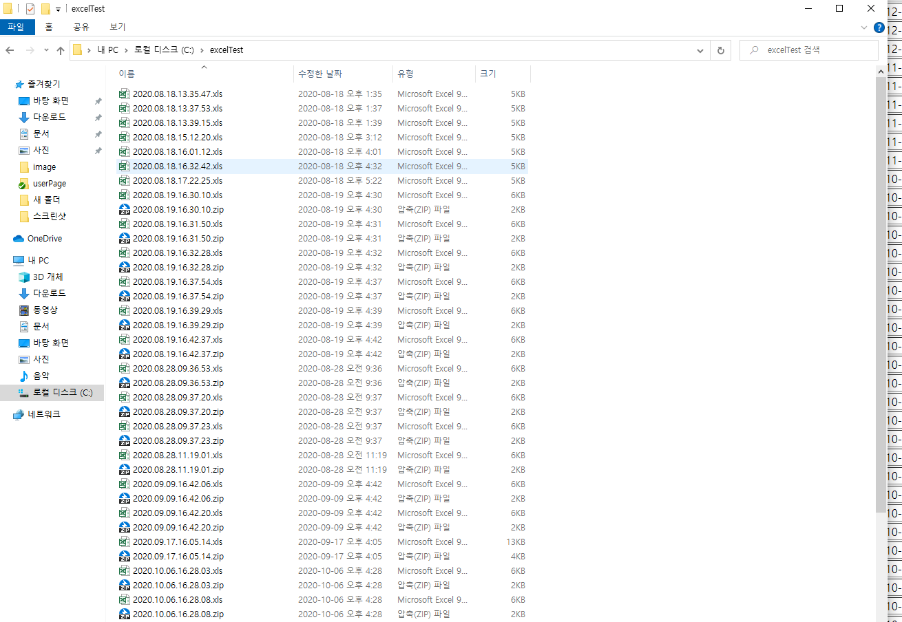
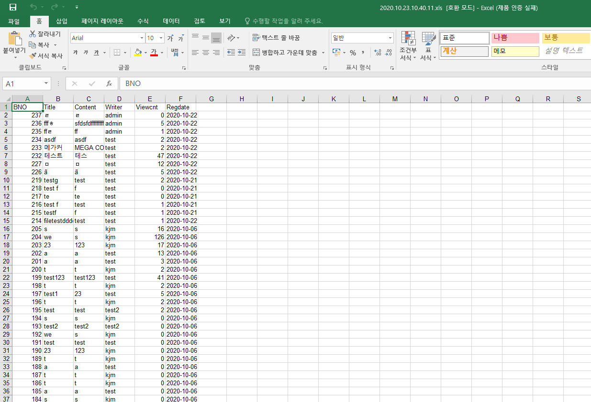
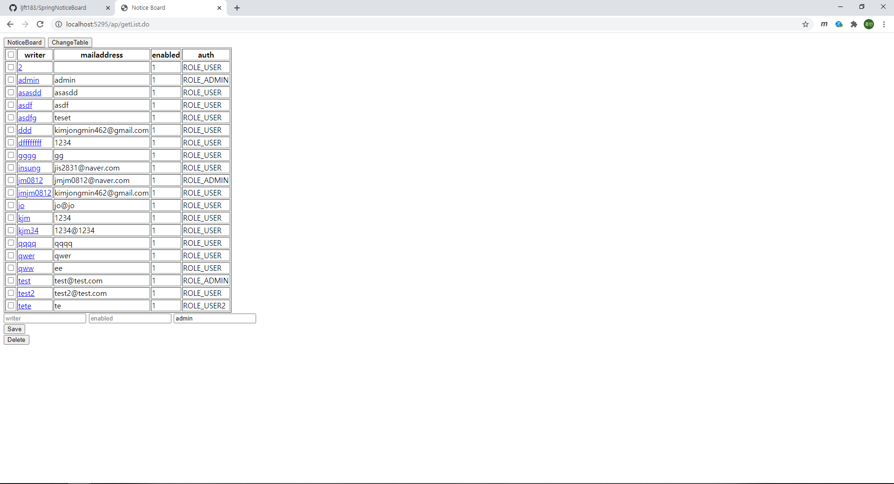
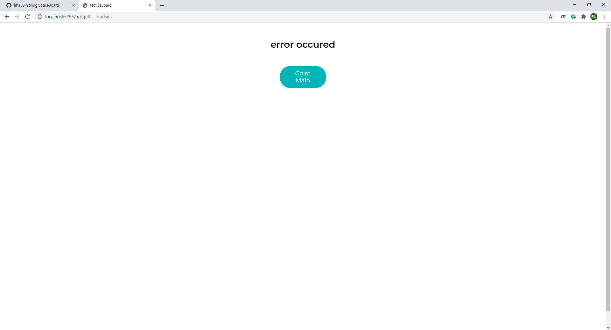

# Admin Page

### 권한 admin의 화면 - noticeBoard.jsp

## 관리자 페이지 - adminPage.jsp

### 기본 표현 화면 board-On User-Off

### 하단 구성

### 엑셀 파일 확인

엑셀 암호화 및 압축 기능 시험 완료

### ChangeTable 버튼을 통한 테이블 변경

Board의 제어 기능과 같이 구성

# 번외

## error Page 관리 - error.jsp

### 404, 500, 등 오류 페이지를 위한 별도 페이지 구성

404 에러를 유발 시킨 화면

