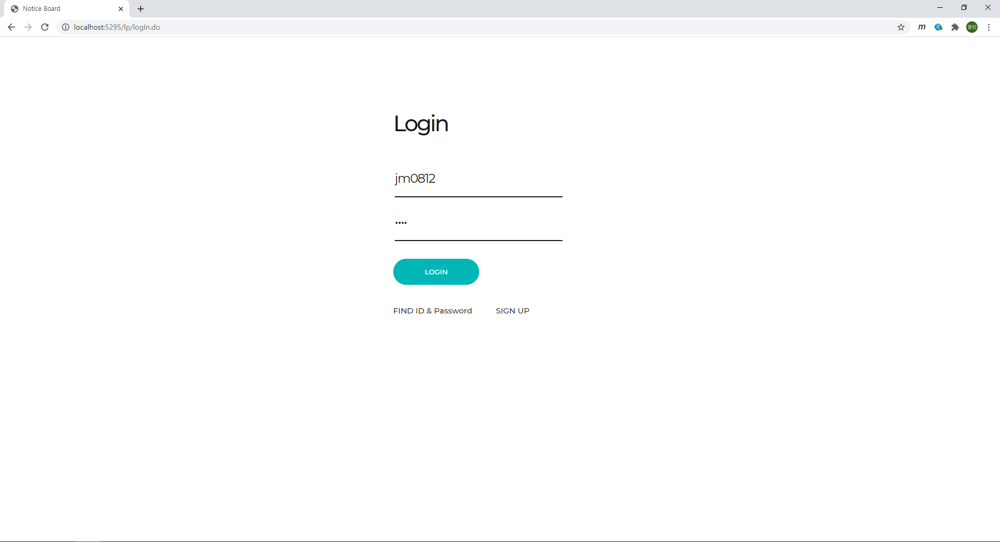
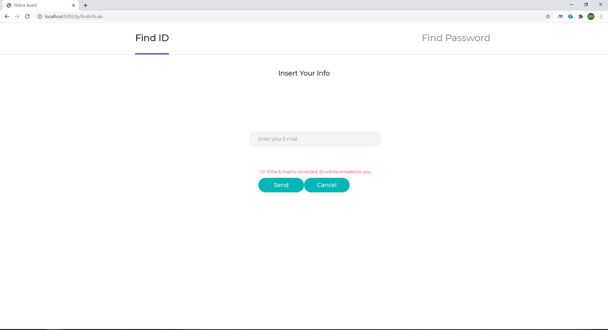
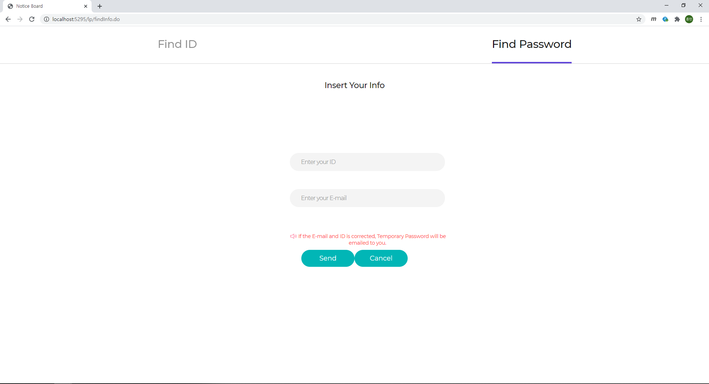
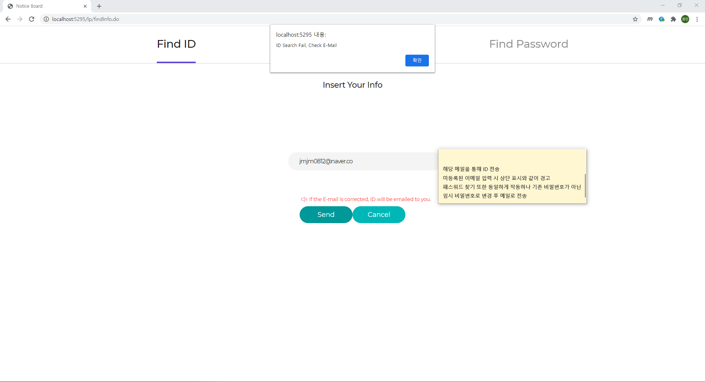
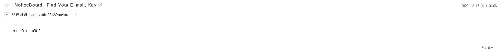
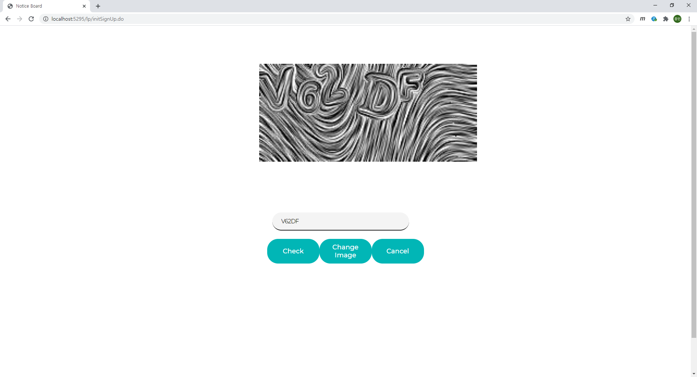
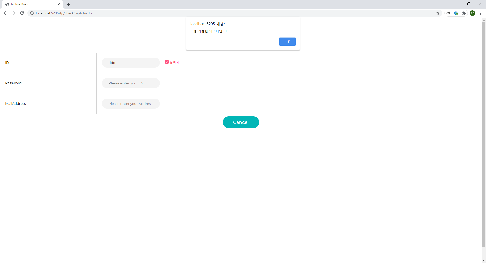
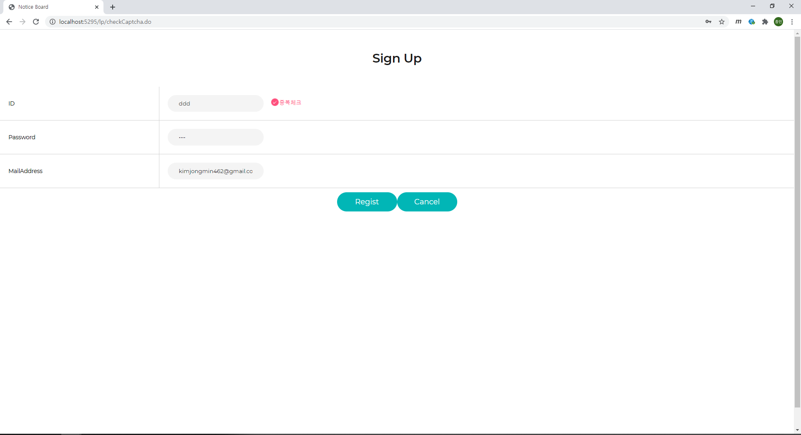

# SpringNoticeBoard

## 로그인 화면 - login.jsp

## ID, 비밀번호 찾기 화면 - findInfo

### Id를 찾는 경우 

### Password를 찾는 경우

### Id 찾기  진행

### Id 찾기 결과 화면

## 회원가입 화면

### 자동 가입 방지를 위한 네이버 Open API Captcha 사용 화면 - cpatcha.jsp

### 회원가입 화면 (중복검사 전) - signUp.jsp

### 중복검사 후

### 별도 옵션 설명

logout.jsp - 로그아웃 시 로그아웃 알림을 호출 후  login 화면 호출  
loginError.jsp - 로그인 실패 시 알림 호출 후 login 화면 호출  
inspectionTime.jsp - Captcha로 인해 생긴 이미지 파일 정리 시간 (11:59:30 ~ 12:02:00) 동안 회원가입 방지

