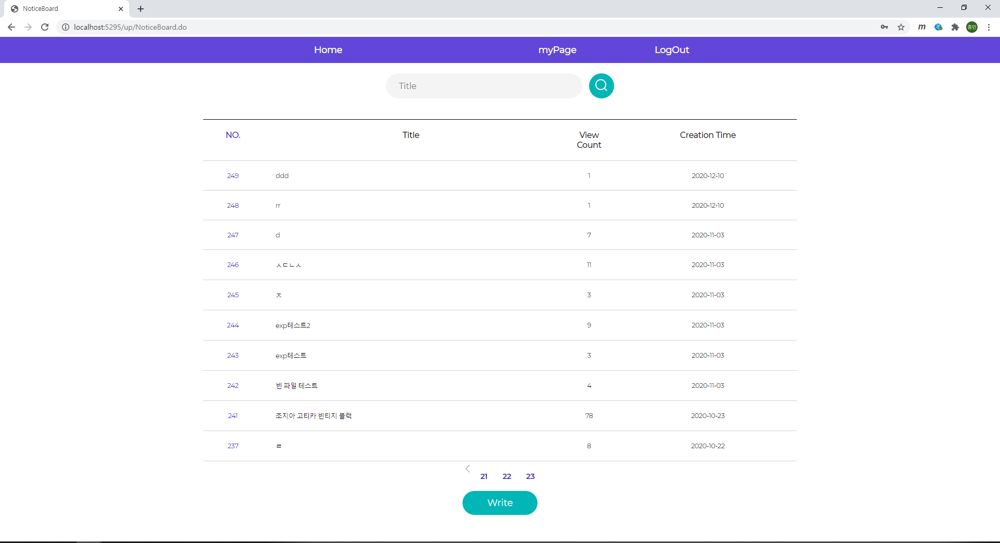

# Uesr Page

## 로그인 화면

## 게시글 목록 화면 - up/NoticeBoard.jsp

 Tiles를 통한 Layout Header 설정 현재 적용 baseLayout.jsp  
 Home 버튼을 통한 NoticeBoard.jsp로의 이동  
 myPage 버튼을 통한 userInfo.jsp 로의 이동  
 logOut 버튼을 통한 로그아웃

### 기본 화면

### 페이징 확인

### 제목 검색된 게시글 목록

### 검색된 페이징

## 게시글 작성 화면 - writePost.jsp

### 작성 화면

### 작성 후 게시글 목록

## 게시글 상세 화면 - NoticeBoardDetail.jsp

### 위의 작성된 게시글 상세 화면 - 본인 게시글의 경우 security 권한을 통한 수정, 삭제 버튼 show

### 파일 다운로드 확인 화면

### 댓글 등록 결과 화면 

comment 버튼을 통한 댓글 show & hide 설정  
현재 로그인된 이용자 등록 댓글 시 댓글 Delete 버튼 활성화

